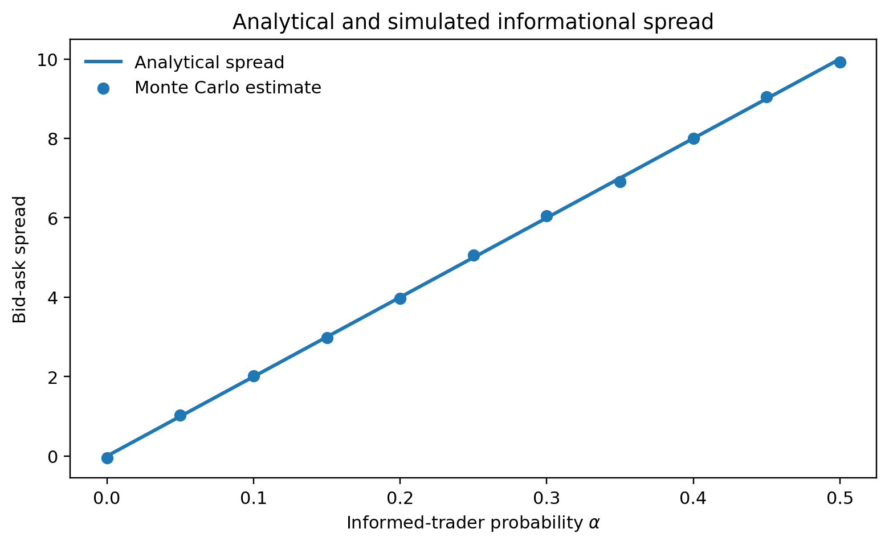

# Bayesian Market Making under Adverse Selection

An OCaml research project on information-sensitive quoting, sequential Bayesian learning, model misspecification, changing information regimes, and inventory control.

The core model is deliberately small. An asset settles at either 90 or 110. Some customers know that terminal value; the rest trade for exogenous reasons. Since order direction is informative, a competitive market maker conditions its quotes on the event that a customer chooses to buy or sell. At the symmetric prior this gives the closed-form spread

$$
\mathrm{Ask}-\mathrm{Bid}=(H-L)\alpha
$$

The formula is simple enough to derive by hand and strict enough to catch a broken simulator. The later experiments then ask where that clean result survives, where it becomes fragile, and which conclusions are artefacts of the execution model.



## What the project contains

- a typed OCaml simulation engine built with Dune;
- static, sequential Bayesian, joint-parameter, and rolling-window strategies;
- reproducible hidden-state and order-flow generation;
- explicit cash, inventory, trade-level P&L, and terminal wealth accounting;
- eight Monte Carlo experiment groups and twelve checked-in CSV datasets;
- fifteen publication-ready figures in PDF and PNG;
- twenty-three targeted OCaml regression tests;
- an independent NumPy implementation used as a numerical cross-check;
- automated output-level checks for analytical and qualitative invariants;
- a 16-page LaTeX research paper;
- Linux/macOS, Windows PowerShell, Make, and GitHub Actions pipelines.

The information and inventory environments remain separate on purpose. In the information model, one order executes at every step, so moving a quote cannot reduce volume. Inventory control is therefore tested in a second environment where fill probability depends on quote distance. Combining the two without changing the arrival mechanism would create a more impressive-looking program and a less defensible experiment.

## Experiments

1. **Analytical spread validation.** Compare the closed-form informational spread with Monte Carlo conditional-value estimates.
2. **Bayesian price discovery.** Track posterior confidence and the time required to reach 90%, 95%, and 99% confidence in the correct state.
3. **Static versus Bayesian quoting.** Compare fair-value error, terminal P&L dispersion, informed-flow losses, and paired strategy differences on identical order tapes.
4. **Parameter misspecification.** Vary the true informed-trader probability $\alpha$ against the market maker's assumed value $\widehat{\alpha}$.
5. **Unknown $\alpha$.** Infer the terminal state and information intensity jointly on a finite parameter grid.
6. **Regime change.** Raise $\alpha$ abruptly halfway through an episode and compare a full-history posterior with rolling windows.
7. **Inventory skew.** Measure the trade-off between position exposure, lower-tail P&L, and average profitability.
8. **Quote distance.** Introduce distance-sensitive fills and recover an interior spread-volume optimum.

## Reference run

The checked-in numerical run uses seed `20260831` and the full workload. Its main observations are summarised below.

| Experiment | Reference observation |
|---|---|
| Spread validation | Maximum absolute theory-simulation gap: `0.087` price units. |
| Price discovery | Median time to 95% confidence: 28 trades at `alpha = 0.20`, versus 8 at `alpha = 0.40`. |
| Static vs Bayesian | At `alpha = 0.20`, Bayesian updating reduces fair-value RMSE by `40.7%` and terminal P&L standard deviation by `61.1%`. |
| Paired comparison | Mean Bayesian-minus-static RMSE difference at `alpha = 0.20`: `-4.07`, 95% Monte Carlo interval `[-4.15, -3.99]`. |
| Misspecification | True `alpha = 0.40`, assumed `0.20`: mean terminal P&L `-19.09`; correct specification: `0.41`. |
| Unknown alpha | Mean absolute error of the joint posterior mean: `0.067`. |
| Regime change | A 20-trade rolling filter adapts on 99.1% of paths with median delay 17 trades; the full-history filter adapts on 13.0%. |
| Inventory skew | Moving the skew coefficient from `0` to `0.10` reduces mean maximum inventory by `56.8%` and P&L volatility by `68.3%`, while mean P&L falls by `3.9%`. |
| Quote distance | Mean P&L peaks at a half-spread of `1.00` in the stated toy execution model. |

These are simulation results, not evidence of live-market profitability. The misspecification experiment is especially sensitive to exogenous execution: when every incoming order must trade, excessively wide quotes do not lose volume and can appear artificially attractive. The report treats that outcome as a model failure mode rather than a trading result.

## Repository map

```text
.
├── lib/
│   ├── domain.ml              Core market, order-side, and quote types
│   ├── binary_model.ml        Likelihoods, Bayes updates, and competitive quotes
│   ├── order_tape.ml          Reproducible stationary and regime-switching flow
│   ├── joint_filter.ml        Joint posterior over value and alpha
│   ├── rolling_filter.ml      Finite-memory regime estimator
│   ├── strategy.ml            Strategy variants behind one interface
│   ├── information_sim.ml     Accounting and adverse-selection experiments
│   ├── inventory_sim.ml       Quote-sensitive fills and inventory skew
│   ├── stats.ml               Monte Carlo summaries and quantiles
│   └── experiments.ml         Experiment runners and CSV output
├── bin/main.ml                Command-line entry point
├── test/test_suite.ml         Twenty-three model and accounting checks
├── analysis/
│   ├── reference_runner.py    Independent NumPy parity implementation
│   ├── check_outputs.py       Dataset and model-invariant validation
│   └── plot_results.py        Figures and generated LaTeX fragments
├── results/
│   ├── data/                  Full reference-run CSVs
│   └── figures/               Fifteen figures in PDF and PNG
├── report/
│   ├── main.tex               Paper source
│   └── Bayesian_Market_Making_Report.pdf
├── docs/
│   ├── MODEL_NOTES.md
│   └── REPRODUCIBILITY.md
├── scripts/reproduce.sh
├── scripts/reproduce.ps1
└── .github/workflows/
    ├── ci.yml
    └── full-reproduction.yml
```

## Build and run

The project targets OCaml 5.2.1, while remaining compatible with OCaml 4.14 or newer.

```bash
opam switch create . 5.2.1
opam install . --deps-only --with-test
opam exec -- dune build @all
opam exec -- dune runtest
```

Run the full OCaml experiment suite:

```bash
opam exec -- dune exec bin/main.exe -- all \
  --seed 20260831 \
  --out results/data
```

Use `--quick` for the reduced CI-sized workload. Individual command names are `spread-validation`, `price-discovery`, `strategy-comparison`, `misspecification`, `unknown-alpha`, `regime-change`, `inventory`, and `quote-distance`.

Validate the generated datasets, rebuild the figures, and compile the paper:

```bash
python -m pip install -r analysis/requirements.txt
python analysis/check_outputs.py --input results/data
python analysis/plot_results.py \
  --input results/data \
  --output results/figures \
  --report-dir report

cd report
pdflatex -interaction=nonstopmode -halt-on-error main.tex
pdflatex -interaction=nonstopmode -halt-on-error main.tex
```

The complete platform scripts are:

```bash
./scripts/reproduce.sh
```

```powershell
.\scripts\reproduce.ps1
```

## Testing and experimental controls

The implementation enforces several choices that materially affect the results:

- the hidden terminal value and trader identity are never passed to a strategy;
- a quote is formed before the current order direction is observed;
- competing strategies receive the same order tapes;
- random seeds and workload profiles are written into `run_manifest.csv`;
- trade-level economic P&L must reconcile with cash plus marked inventory;
- paired strategy differences are reported with Monte Carlo uncertainty;
- the closed-form spread acts as a numerical test oracle;
- output checks reject malformed grids, posterior probabilities outside their support, broken P&L attribution, non-monotone fill curves, and boundary quote-distance optima.

The unit suite is dependency-free beyond the OCaml standard library and Dune. Run it with:

```bash
opam exec -- dune runtest
```

The main GitHub Actions workflow repeats the build, tests, reduced OCaml experiment run, output validation, plotting, and paper compilation from a clean environment. The manual `full-reproduction` workflow runs the complete OCaml workload and uploads a fresh report, datasets, figures, manifest, and checksums. The independent NumPy implementation can be run separately as a numerical cross-check.

## Limits of the model

The terminal value is binary. Informed traders observe it perfectly, trade one unit, and do not behave strategically. Noise flow is balanced and independent. There is one market maker, no queue position, tick size, latency, fees, competing venue, cross-asset hedge, or endogenous informed demand. The fill curve in the inventory model is imposed rather than calibrated. The information and inventory mechanisms are not solved in one equilibrium.

Those omissions define the range of valid interpretation. A richer simulator is not automatically a better one; several realistic mechanisms would interact, making it harder to tell whether a result came from learning, inventory pressure, market impact, or an arbitrary calibration choice. The paper and [`docs/MODEL_NOTES.md`](docs/MODEL_NOTES.md) discuss these boundaries in detail.

## Numerical provenance

The OCaml implementation is the primary numerical engine. The checked-in CSV datasets, figures, and research paper correspond to the full OCaml reproduction using seed `20260831`. The authoritative provenance record is `results/data/run_manifest.csv`, which records the engine, seed, workload profile, and experiment count used to generate the reference outputs. The independent NumPy implementation in `analysis/reference_runner.py` is retained as a numerical cross-check: it reimplements the model equations without calling or wrapping the OCaml executable and is not the source of the checked-in reference results.

The complete provenance and reproduction policy is in [`docs/REPRODUCIBILITY.md`](docs/REPRODUCIBILITY.md).

## Paper

- [`report/Bayesian_Market_Making_Report.pdf`](report/Bayesian_Market_Making_Report.pdf)
- [`report/main.tex`](report/main.tex)

## License

MIT. See [`LICENSE`](LICENSE).
